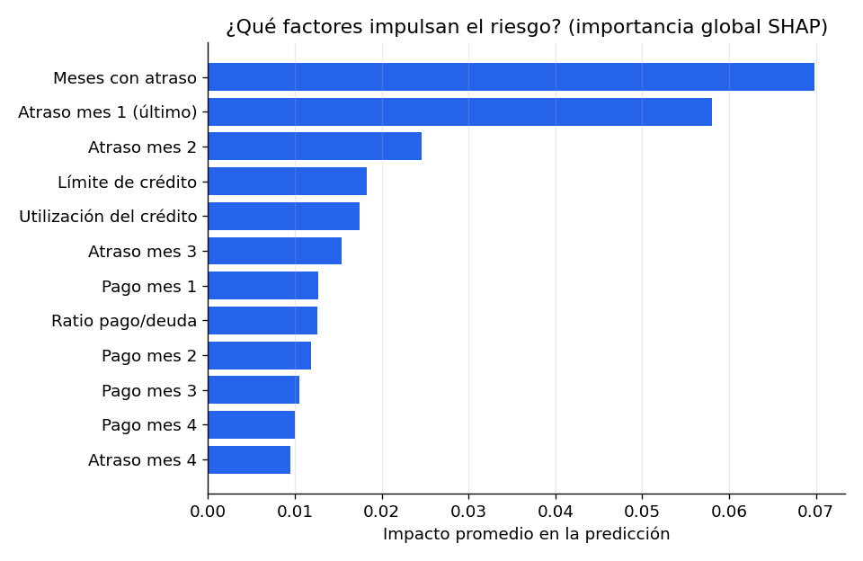
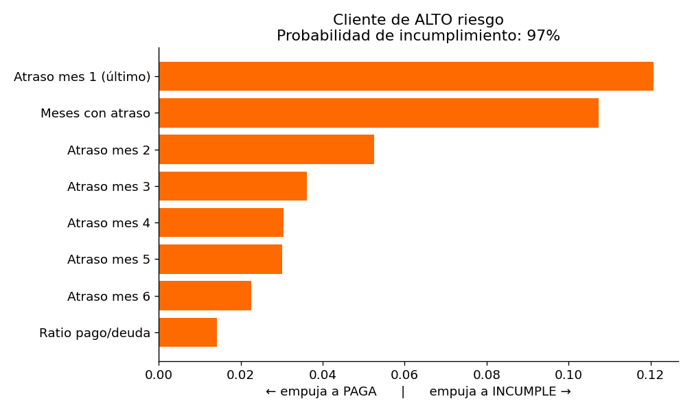

# 🐆 SkyScore — Predictor de riesgo crediticio explicable


> Un modelo de Machine Learning que estima la probabilidad de que un cliente **incumpla su próximo pago** y explica **por qué**, con una app web interactiva.

🔗 **Demo en vivo:** _(pega aquí tu URL de Streamlit una vez desplegada)_

---

## 🎯 El problema

El riesgo crediticio es el corazón del negocio bancario: predecir quién incumplirá permite tomar mejores decisiones de crédito. Pero hay un requisito clave — por regulación, un banco **no puede usar modelos de "caja negra"**: tiene que poder explicar cada decisión. SkyScore ataca ambas cosas: **predice** y **explica**.

## 📊 Datos

Dataset público **"Default of Credit Card Clients"** (UCI): 30,000 clientes de Taiwán con su límite de crédito, datos demográficos, historial de pagos y montos de recibos. Target: si el cliente incumple el mes siguiente (**22% de incumplimiento** → clases desbalanceadas).

## 🔍 Enfoque

1. **EDA** — el atraso reciente en pagos resultó el predictor más fuerte: un cliente al día incumple ~13%, pero con 2+ meses de atraso sube a ~70%.
2. **Modelado** — comparación de tres modelos con métricas pensadas para desbalanceo (F1, recall, ROC-AUC), no accuracy:

   | Modelo | Recall | F1 | ROC-AUC |
   |---|---|---|---|
   | Regresión Logística (baseline) | 57% | 51% | 0.75 |
   | **Random Forest** ✅ | 60% | **54%** | 0.78 |
   | Gradient Boosting | 63% | 53% | 0.78 |

3. **Explicabilidad (SHAP)** — importancia global de factores + explicación individual de cada predicción.
4. **App (Streamlit)** — formulario interactivo con resultado y explicación en vivo.

## 🖼️ Vistazo

| Factores globales | Explicación de un cliente |
|---|---|
|  |  |

## 🚀 Cómo correrlo

```bash
git clone https://github.com/skyluw/SkyScore.git
cd SkyScore
pip install -r requirements.txt

# (opcional) reproducir el análisis y reentrenar
python code/eda.py
python code/train.py
python code/explain.py

# levantar la app web
streamlit run app.py
```

## ☁️ Desplegar gratis

1. Sube este repo a GitHub.
2. Entra a [share.streamlit.io](https://share.streamlit.io), conecta tu cuenta de GitHub.
3. Elige el repo, archivo principal `app.py`, y *Deploy*.
4. Copia la URL pública resultante y pégala arriba en "Demo en vivo".

## 📁 Estructura

```
SkyScore/
├── app.py                  # App web (Streamlit)
├── code/
│   ├── eda.py              # Análisis exploratorio
│   ├── train.py            # Entrenamiento y evaluación de modelos
│   ├── explain.py          # Explicabilidad con SHAP
│   └── scoring.py          # Lógica de predicción reutilizable
├── data/
│   └── credit_default.csv  # Dataset (UCI)
├── models/
│   ├── skyscore_model.joblib
│   └── metrics.json
├── reports/figures/        # Gráficos generados
└── requirements.txt
```

## ⚠️ Nota

Proyecto de demostración con fines de aprendizaje y portafolio. **No** es una herramienta de evaluación crediticia real. El dataset incluye variables demográficas (sexo, educación) que en un sistema productivo deben tratarse con criterios de equidad y cumplimiento regulatorio.

## 👩‍💻 Autora

**Cielo Chávez** — [GitHub @skyluw](https://github.com/skyluw) · [LinkedIn](https://www.linkedin.com/in/cielo-chavez)
